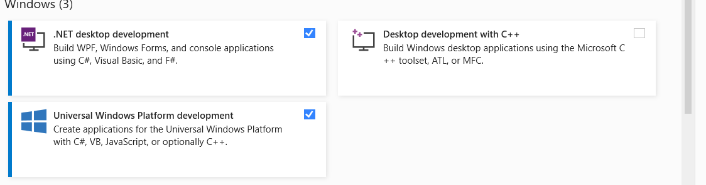

# ConflictGraphAnalyzer

A prototype tool that takes as input a possibly asynchronous program. It enumerates all sound asynchronizations (data races free) of the given program. 

## Dependencies

ConflictGraphAnalyzer requires: 

### OS

Windows 10

### Download Visual Sutdio

Download Visual Studio 2017 Installer [VS 217](https://my.visualstudio.com/Downloads?q=visual%20studio%202017&wt.mc_id=o~msft~vscom~older-downloads) Select version 15.9:


### Install Visual Studio

Make sure you follow the following installation steps: 

Select .NET desktop development and make sure you check the options shown on the right side of the picture in blow:


Then, select Universal Windows Platform development:




## Building

To build ConflictGraphAnalyzer run:

```
$ dotnet build ConflictGraphAnalyzer/ConflictGraphAnalyzer.sln
```

The compiled ConflictGraphAnalyzer binary is
`ConflictGraphAnalyzer/ConflictGraphAnalyzer/bin/${CONFIGURATION}/${FRAMEWORK}/ConflictGraphAnalyzer.exe`.

## Benchmark 

Each sub-directory ```Y``` of the ```Resources``` directory contains the files of the corresponding benchmark program.

## Testing 

### Results Reproduction

To run ConflictGraphAnalyzer with all the benchmark programs use the following command: 

```
$ .\ConflictGraphAnalyzer\ConflictGraphAnalyzer\bin\Debug\net472\ConflictGraphAnalyzer.exe
```

The expected output of the above command is: 

```
| Application Name       | nbMethods | nbInvocations | nbAsyncInvocations | nbPotentialMovableAwaits | nbMovableAwaits | nbRepairedDataRaces | nbAsychronizations | Time duration (ms) |
 |--------------------------------------------------------------------------------------------------------------------------------------------------------------------------------------|
 | SyntheticBenchmark-1   | 3         | 6             | 5                  | 4                        | 4               | 5                   | 9                  | 1409               |
 | SyntheticBenchmark-2   | 4         | 12            | 10                 | 6                        | 3               | 3                   | 8                  | 28                 |
 | SyntheticBenchmark-3   | 6         | 16            | 13                 | 9                        | 7               | 4                   | 128                | 133                |
 | SyntheticBenchmark-4   | 6         | 17            | 14                 | 10                       | 8               | 5                   | 256                | 542                |
 | SyntheticBenchmark-5   | 6         | 17            | 14                 | 10                       | 8               | 9                   | 272                | 647                |
 | Azure-Remote           | 10        | 12            | 5                  | 0                        | 0               | 0                   | 1                  | 694                |
 | Azure-Webjobs          | 6         | 11            | 2                  | 0                        | 0               | 0                   | 1                  | 27                 |
 | FritzDectCore          | 7         | 11            | 8                  | 1                        | 1               | 0                   | 2                  | 94                 |
 | MultiPlatform          | 2         | 5             | 3                  | 2                        | 2               | 0                   | 4                  | 7                  |
 | NetRpc                 | 13        | 18            | 11                 | 4                        | 1               | 3                   | 3                  | 138                |
 | TestAZureBoards        | 3         | 3             | 3                  | 0                        | 0               | 0                   | 1                  | 33                 |
 | VBForums-Viewer        | 7         | 10            | 7                  | 3                        | 2               | 1                   | 6                  | 61                 |
 | Voat                   | 3         | 5             | 5                  | 2                        | 1               | 1                   | 3                  | 104                |
 | WordpressRESTClient    | 3         | 10            | 8                  | 4                        | 2               | 1                   | 4                  | 18                 |
 | ReadFile-Stackoverflow | 2         | 3             | 3                  | 1                        | 0               | 1                   | 1                  | 5                  |
 | UI-Stackoverflow       | 3         | 4             | 4                  | 3                        | 3               | 3                   | 12                 | 14                 |


```

Note that the runtime (in millisecond) may differ from a machine to a machine. 

### Simple Test

To run ConflictGraphAnalyzer with ```SyntheticBenchmark-1``` program run: 

```
$ .\ConflictGraphAnalyzer\ConflictGraphAnalyzer\bin\Debug\net472\ConflictGraphAnalyzer.exe ./Resources/SyntheticBenchmark-1/SyntheticBenchmark-1.sln 0
```

The last argument to ConflictGraphAnalyzer (i.e., 0) is the project identifier, which contains the input program, in the VS solution. 

The expected output of the above command is: 

```
===============================
The runtime is: '3715'
The properties are: '{"nbMethods":3,"nbInvocations":6,"nbAsyncInvocations":5,"nbPotentialMovableAwaits":4,"nbMovableAwaits":4,"nbRepairedDataRaces":5,"nbAsychronizations":9,"distanceAwaits":6}'
===============================
``` 

Note that the runtime (in millisecond) may differ from a machine to a machine. 


## Performance Tests Reporduction

Each sub-directory ```Y``` of the ```Preformance-Tests``` directory contains the project files associated with one of the three programs used in Figure 2.
Each project corresponds to one instance of the corresponding programs where the position of await is fixed inside the function ```Foo``` inside the file ```Program.cs```. To change to another instance, only uncomment the correponding await inside ```Fo``` and comment the remaining two. We believe the exect value of runtime might differ from machine to machine but the main idea of having a specific placement of await optimal in term of runtime for each program will be observable. 

